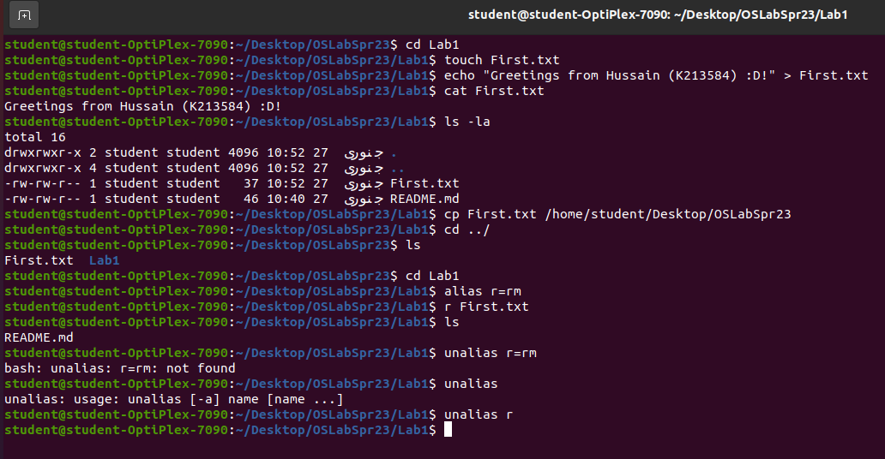
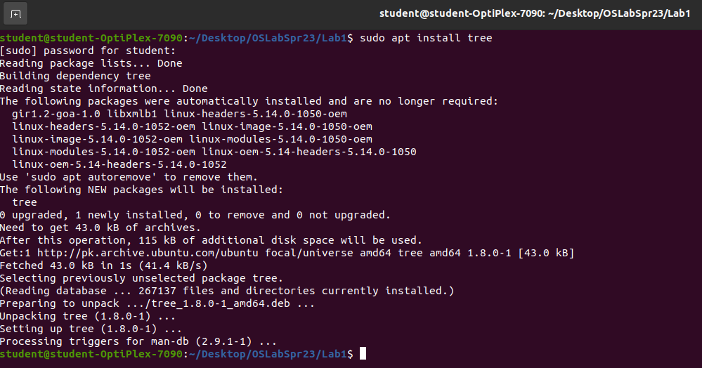
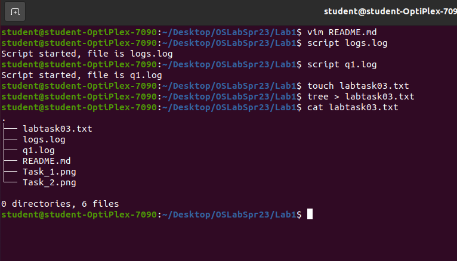
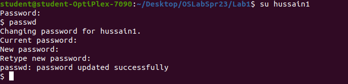
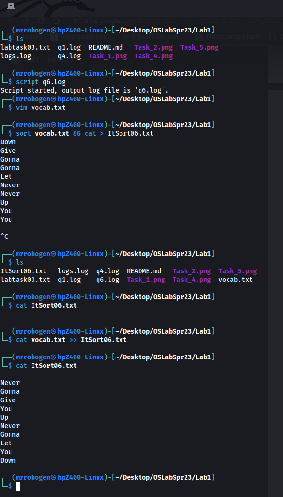

# OSLabSpr23
Assignment for OS Lab-1. K213584

**Task 1:**
Following is the image of 7 basic linux commands on the terminal:

**Task 2:**
Following is the snap of installing 'tree' using th apt manager:

**Task 3:**
**a)** After typing the tree command the terminal shows the tree hierarchy.
**b)** Text file created.
**c)** Done.
Image:

**Task 4:**
New log script created. 2 new users also created. Following is the image attached: 

**Task 5:**
Password changed of second user. I used the 'su' command to switch to the second user and used the 'passwd' command
to change the password of the second user. Attached below is the screenshot of the process:

**Task 6:**
Following is a screenshot of the file created with 10 vocabulary words in it and sorted using the 'sort' command.

