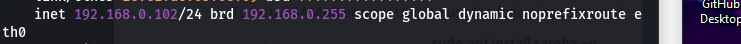
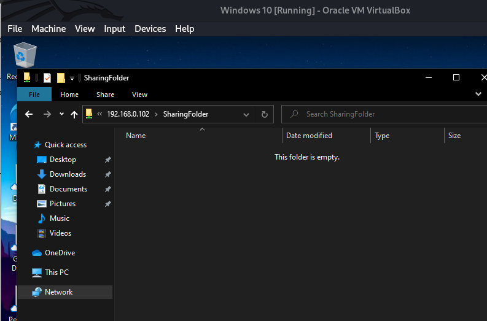

**Task 1:**
Sent the email to my university email from my personal email. Here is image
showing that the script works:

Here is a detailed view:

**Task 2:**
Created the samba install script and made a user so that I can access samba on windows.
Here is a screenshot of running samba on windows:

